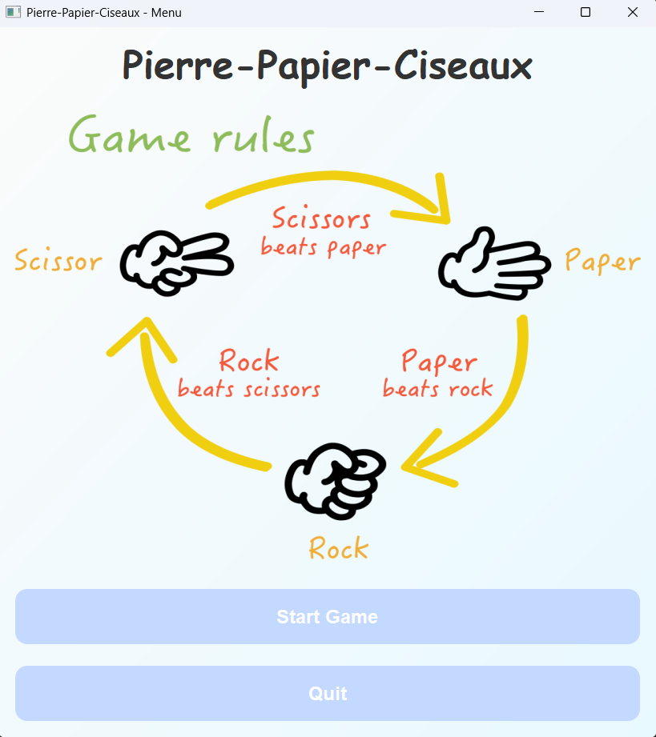
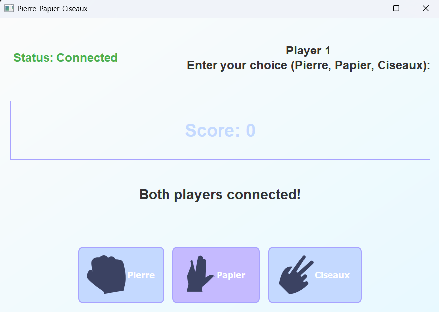
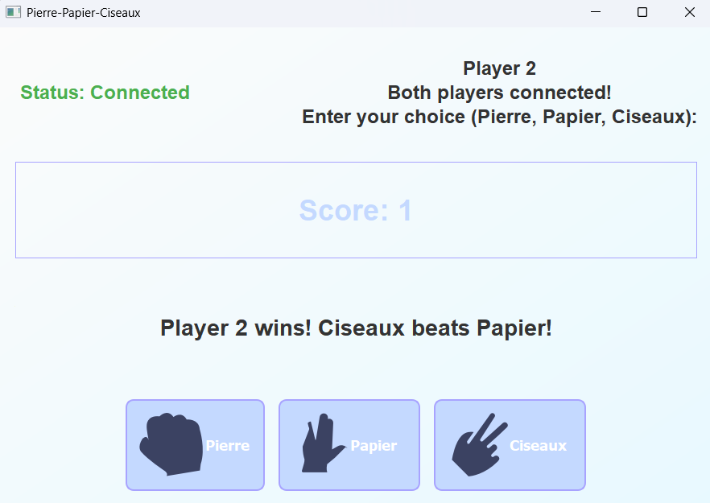

# Rock-Paper-Scissors Game

### Project Overview
This project is a networked implementation of the classic Rock-Paper-Scissors game. It consists of a graphical client application and a server that handles game logic and communication between clients. The client is built using PyQt5, providing a user-friendly interface, while the server manages game sessions and determines the winner based on player choices.

### Features
- **Multiplayer Support**: Allows two players to connect to the server and play against each other.
- **Graphical Interface**: User-friendly GUI for selecting choices (Rock, Paper, Scissors).
- **Real-time Game Results**: Displays the outcome of each round and updates the score accordingly.
- **Network Communication**: Uses sockets for communication between clients and the server.

### Dependencies
- **Python 3.x**
- **PyQt5**: For the graphical user interface.
- **socket**: Built-in Python module for networking.

### How to Run
#### 1. Start the Server
- Open a terminal and navigate to the server script directory.
- Run the server script:
  ```bash
  python server.py
  ```
 

#### 2. Start the Client
- Open another terminal and navigate to the client script directory.
- Run the client application:
  ```bash
  python client_gui.py
  ```
 

- The client GUI will appear. Click "Start Game" to connect to the server.

#### 3. Play the Game
- Connect two client instances to play against each other.
- Select your choice (Rock, Paper, or Scissors) by clicking the respective button.
- The server will determine the winner and display the result on both clients.

### Game Rules
- **Rock beats Scissors**
- **Scissors beats Paper**
- **Paper beats Rock**
- If both players choose the same option, it's a tie.

### Server-Client Communication
#### Client-to-Server:
- Sends choice (Rock, Paper, Scissors) to the server.

#### Server-to-Client:
- Sends game results and current scores to clients.
- Assigns player roles (Player 1 or Player 2) upon connection.

### Files and Resources
#### Client Files:
- `client_gui.py`: The PyQt5-based GUI client.
- `rock-paper-scissors-game-rules.png`: Rules image displayed in the start menu.
- `icon-rock.svg`, `icon-paper.svg`, `icon-scissors.svg`: SVG icons for the choice buttons.

#### Server Files:
- `server.py`: The server script handling game logic and networking.

### Screenshots
#### Main Menu:


#### Gameplay:


#### Game Results:


### Contributing
Contributions are welcome! If you find any issues or want to add new features, please open an issue or submit a pull request.

